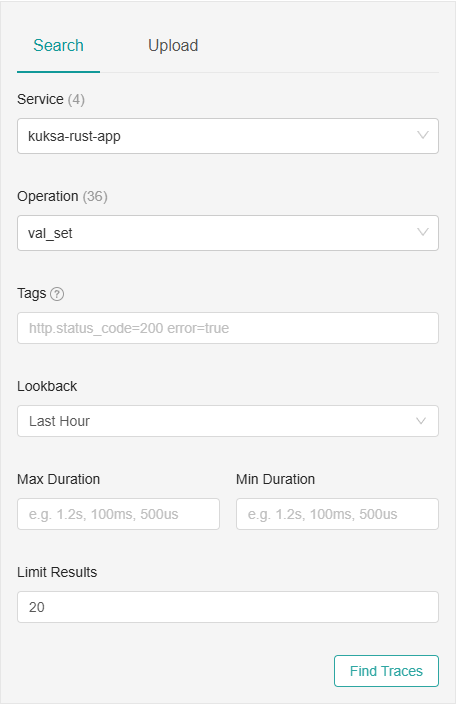
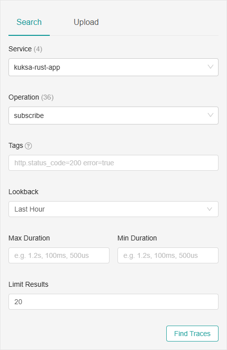
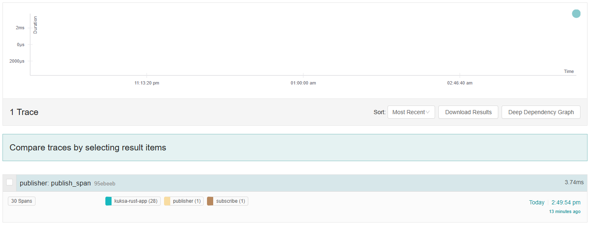
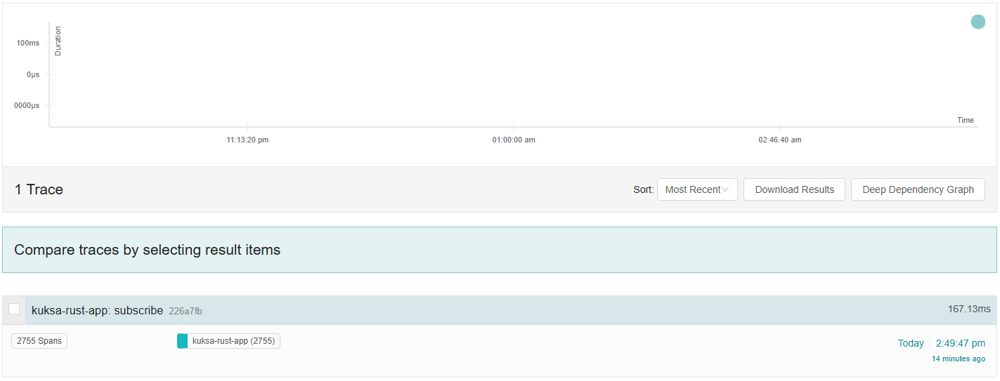
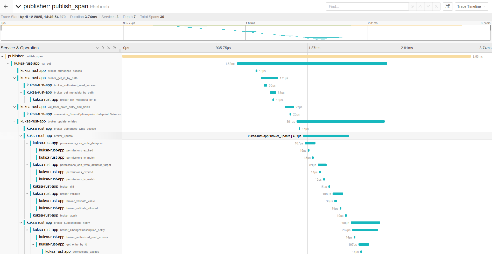

# Kuksa Tools: Telemetry-Enabled Databroker and Clients

This guide provides instructions to run the Kuksa Databroker and its clients, with and without OpenTelemetry instrumentation. It also demonstrates integration with a Jaeger backend for tracing.

---

## 🧰 Components

### 1. Kuksa Databroker with OpenTelemetry (otel)
```bash
env OTEL_BSP_MAX_QUEUE_SIZE=8192 cargo run --bin databroker --features otel -- --address 127.0.0.1 --metadata ./data/vss-core/vss_release_4.0.json --insecure
```

### 2. Kuksa Databroker 
```bash
cargo run --bin databroker -- --address 127.0.0.1 --metadata ./data/vss-core/vss_release_4.0.json --insecure
```

### 3. Kuksa Databroker (with stats, for black-box testing)
```bash
cargo run --bin databroker --features stats -- --address 127.0.0.1 --metadata ./data/vss-core/vss_release_4.0.json --insecure
```

---

### 4. Clients

#### Publisher
```bash
cargo run --bin publisher
```

#### Publisher with OpenTelemetry
```bash
cargo run --bin publisher-otel
```

#### Subscriber
```bash
cargo run --bin subscriber
```

#### Subscriber with OpenTelemetry
```bash
cargo run --bin subscriber-otel
```

---

## 🔧 Setup Instructions

### Step 1: Start the Jaeger Backend

Clone and run the [Jaeger setup repository](https://github.com/LikhithST/opentelemtry-rust-setup.git):

```bash
git clone https://github.com/LikhithST/opentelemtry-rust-setup.git
cd opentelemtry-rust-setup
docker compose up
```

---

### Step 2: Start the Kuksa Databroker

Clone the [kuksa-databroker repository](https://github.com/LikhithST/kuksa-databroker.git):

```bash
git clone https://github.com/LikhithST/kuksa-databroker.git
cd kuksa-databroker
```

Run the instrumented databroker:
```bash
env OTEL_BSP_MAX_QUEUE_SIZE=8192 cargo run --bin databroker --features otel -- --address 127.0.0.1 --metadata ./data/vss-core/vss_release_4.0.json --insecure
```

---

### Step 3: Run the Clients

Clone the [kuksa-tools repository](https://github.com/LikhithST/kuksa-tools.git):

```bash
git clone https://github.com/LikhithST/kuksa-tools.git
cd kuksa-tools
code .
```

> ✅ Open the project in a **VSCode Dev Container**   
> Troubleshoot: if encounter problems, remove already running devcontainer (docker container)

#### Run the kuksa Subscriber

In one terminal:
```bash
cargo run --bin subscriber-otel
```

Expected output:
```
Subscribed to changes...
```

#### Run the kuksa Publisher

In another terminal:
```bash
cargo run --bin publisher-otel
```

Expected output:
```
2025-04-12T12:42:14.186478Z  INFO publisher_otel: Logging initialized
Response: SetResponse { error: None, errors: [] }
```

## See the traces in Jaeger.

http://localhost:16686/


### select the following

<p align="center">
  
  
</p>

### Traces output
1. Publish traces

2. Subscribe traces


### Traces



---
